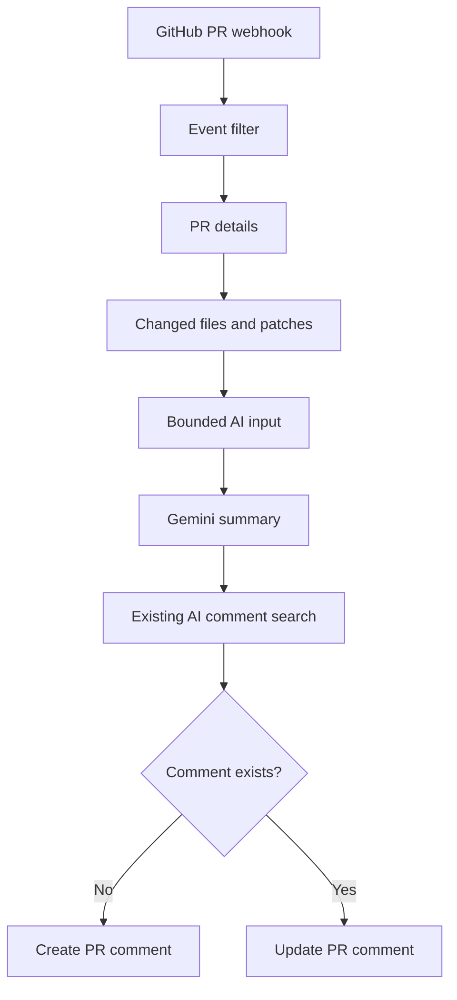

# AI Pull Request Summary — n8n + GitHub API + Gemini

Portfolio project presenting an n8n workflow that automatically analyses a
GitHub Pull Request and publishes an AI-generated technical summary as a PR
comment.

The workflow reacts both to a newly opened Pull Request and to subsequent
commits pushed to its source branch. When the PR changes, the existing AI
comment is updated instead of creating duplicate summaries.

## Live demonstration

- [Example Pull Request with an AI-generated summary](https://github.com/arielprofi995/github-pr-ai-summary-n8n/pull/1)

The example PR adds percentage-discount calculation and automated tests. The
workflow retrieves the changed files and patches, prepares a bounded AI input,
generates a structured summary, and publishes it in the PR conversation.

## Main capabilities

- reacts to GitHub Pull Request events:
  - `opened`,
  - `synchronize`,
  - `reopened`,
- retrieves current PR metadata through the GitHub API,
- retrieves up to 100 changed files and their available patches,
- limits the total patch content passed to AI to 60,000 characters,
- uses Gemini to generate a readable technical summary,
- describes:
  - what changed,
  - added or modified functionality,
  - affected files and areas,
  - potential impact and risks,
  - available tests,
  - change statistics,
- publishes the summary as a GitHub PR comment,
- identifies its own comment using a stable hidden marker,
- updates the existing AI comment after subsequent commits,
- ignores irrelevant Pull Request events.

## Architecture



## Idempotent comment handling

Every generated comment contains the hidden marker:

```html
<!-- n8n-ai-pr-summary -->
```

Before publishing a result, the workflow retrieves the existing PR comments and
searches for that marker:

- if the marker is not found, it creates a comment,
- if the marker exists, it updates the matching comment.

This prevents a new AI comment from being added after every commit.

## Repository structure

```text
.
├── src/
│   ├── discounts.py
│   └── pricing.py
├── tests/
│   ├── test_discounts.py
│   └── test_pricing.py
├── workflow/
│   └── C3_AI_Pull_Request_Summary_Portfolio.json
├── .gitignore
├── LICENSE
└── README.md
```

The Python files provide a small, reviewable example change used to demonstrate
the workflow. The automation itself is implemented in n8n.

## Requirements

- n8n with the GitHub Trigger, HTTP Request, Code, IF, and LangChain nodes,
- GitHub repository with webhook administration rights,
- GitHub OAuth credential for the trigger,
- GitHub API token for the HTTP Request nodes,
- Google Gemini API credential.

## Import and configuration

1. In n8n, choose **Import from File** and select:
   `workflow/C3_AI_Pull_Request_Summary_Portfolio.json`.
2. Open **GitHub Pull Request Trigger**.
3. Assign a GitHub OAuth credential with permission to create a repository
   webhook.
4. Select your repository owner and repository. The sanitized export contains
   the placeholders:
   - `YOUR_GITHUB_USERNAME`,
   - `YOUR_REPOSITORY_NAME`.
5. Create a Header Auth credential for the GitHub API:
   - header name: `Authorization`,
   - value: `Bearer YOUR_GITHUB_TOKEN`.
6. Assign that credential to:
   - **Get PR Details**,
   - **Get Changed Files**,
   - **Get Existing PR Comments**,
   - **Create PR Comment**,
   - **Update PR Comment**.
7. The token should have access only to the selected repository and the minimum
   required permissions:
   - Pull requests: read,
   - Issues: read and write,
   - Metadata: read.
8. Assign a Google Gemini credential to
   **Gemini Flash - PR Summary**.
9. Review the AI prompt and input-size limits.
10. Publish/activate the workflow.

The workflow trigger registers the required GitHub webhook after valid
credentials and repository settings are selected.

## Testing

### New Pull Request

1. Create a feature branch.
2. Commit a small change.
3. Open a Pull Request to the default branch.
4. Confirm that n8n receives the `opened` action.
5. Verify that one AI summary comment appears in the PR.

### Pull Request update

1. Push another commit to the same feature branch.
2. Confirm that n8n receives the `synchronize` action.
3. Verify that the original AI comment is edited.
4. Confirm that no duplicate AI summary comment is created.

### Irrelevant event

Close or otherwise change the PR using an action outside the configured event
list. The workflow should finish through **Ignore Irrelevant PR Event** without
calling Gemini or publishing a comment.

## Security and privacy

- The exported workflow contains no GitHub token, OAuth credential, Gemini API
  key, n8n instance URL, webhook identifier, e-mail address, or execution data.
- GitHub access should be limited to the demonstration repository.
- Tokens should be stored only in n8n Credentials and rotated if exposed.
- The prompt receives PR metadata and code patches. Do not connect this
  demonstration workflow to repositories containing confidential code without
  an approved AI/data-processing policy.

## Current design limits

- The changed-files request retrieves up to 100 files.
- The combined patch content is limited to 60,000 characters.
- GitHub may omit a patch for binary or very large files.
- For production use, add retry/backoff policies, centralized error reporting,
  cost monitoring, and an explicit allow-list for repositories and file types.

